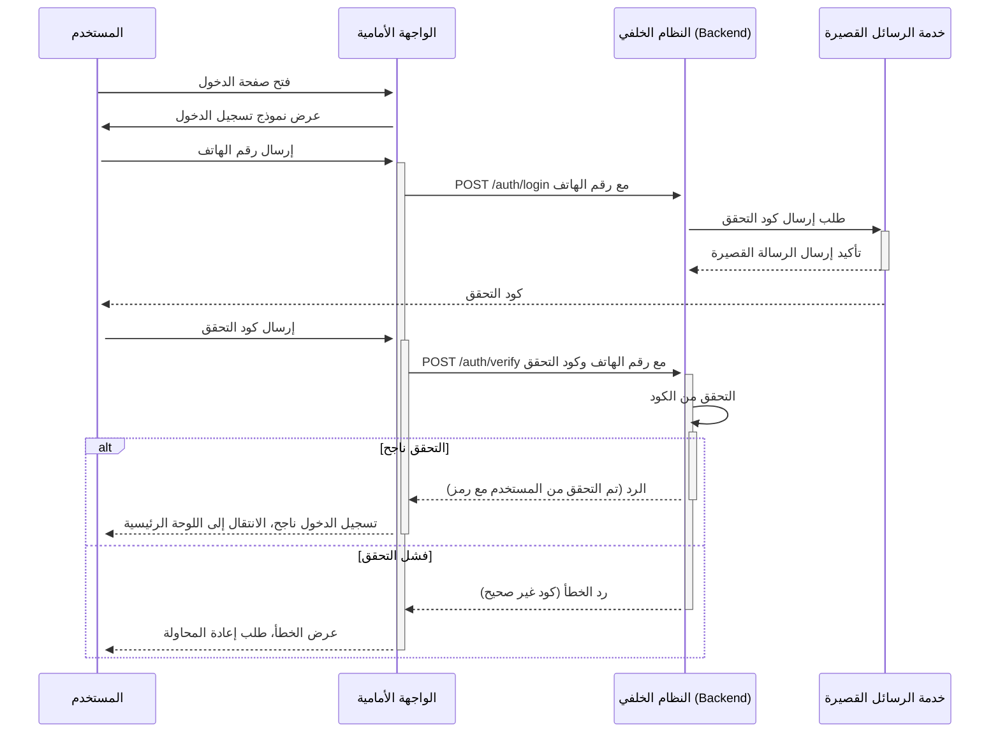
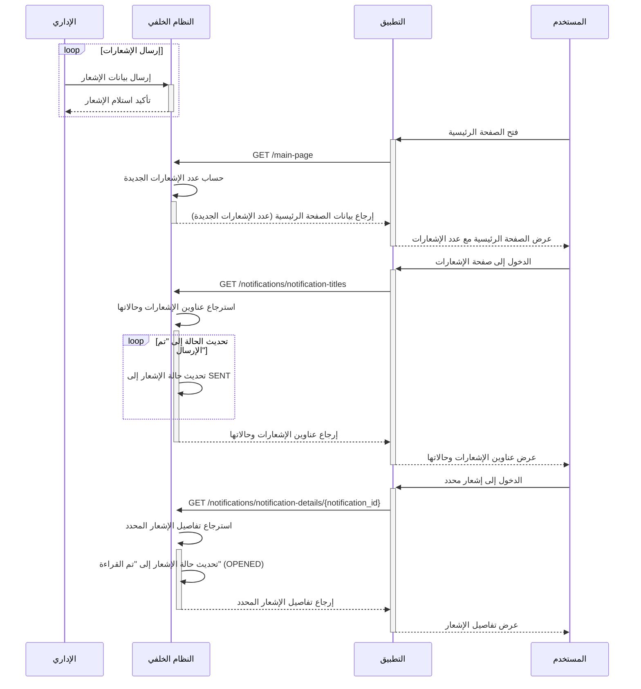
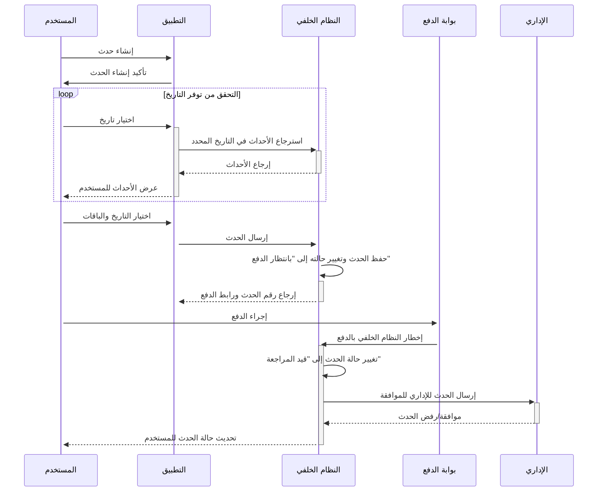
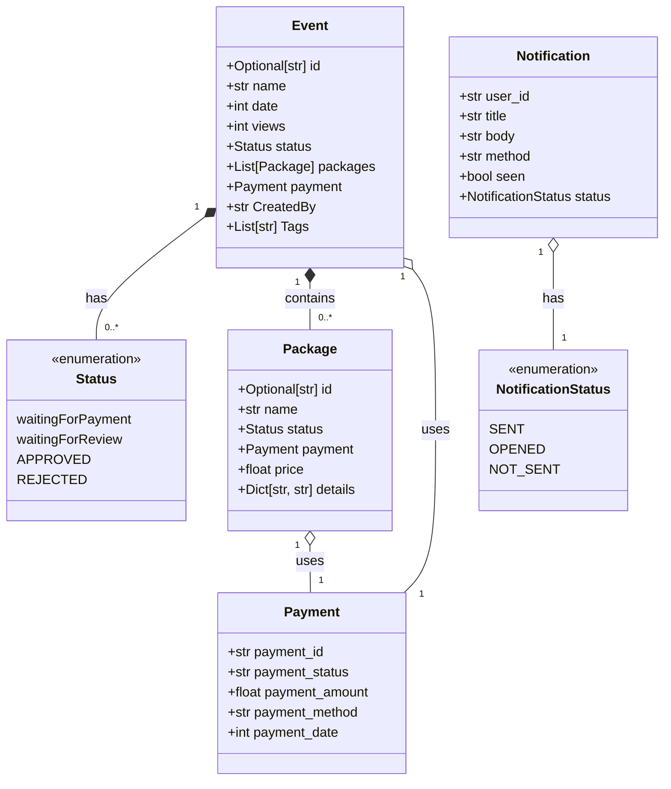

<dev dir="rtl">

### وصف التفاعلات نظام الدخول:




1. **فتح صفحة الدخول**: يقوم المستخدم بفتح صفحة تسجيل الدخول.
2. **عرض نموذج تسجيل الدخول**: تعرض الواجهة الأمامية نموذج تسجيل الدخول للمستخدم.
3. **إرسال رقم الهاتف**: يقوم المستخدم بإدخال رقم هاتفه وإرساله إلى الواجهة الأمامية.
4. **طلب إرسال كود التحقق**: ترسل الواجهة الأمامية طلباً إلى النظام الخلفي لإرسال كود التحقق عبر خدمة الرسائل القصيرة.
5. **تأكيد إرسال الرسالة القصيرة واستلام كود التحقق**: تؤكد خدمة الرسائل القصيرة للنظام الخلفي أن الرسالة قد أُرسلت، ويتلقى المستخدم كود التحقق.
6. **إرسال كود التحقق**: يدخل المستخدم كود التحقق ويرسله إلى الواجهة الأمامية.
7. **التحقق من الكود**: ترسل الواجهة الأمامية الكود إلى النظام الخلفي للتحقق من صحته.
8. **الرد على نتيجة التحقق**:
   - **التحقق ناجح**: إذا كان الكود صحيحًا، يرسل النظام الخلفي تأكيدًا إلى الواجهة الأمامية بأن المستخدم تم التحقق منه بنجاح، ومن ثم تقوم الواجه

ة الأمامية بتوجيه المستخدم إلى اللوحة الرئيسية.
   - **فشل التحقق**: إذا كان الكود غير صحيح، يرسل النظام الخلفي رد فعل بالخطأ إلى الواجهة الأمامية، التي بدورها تعرض رسالة خطأ للمستخدم وتطلب منه إعادة المحاولة.


Here's the API documentation for the Authentication endpoints translated into Arabic:

### **1. نقطة نهاية تسجيل الدخول**

#### **POST** `/auth/login`
**الملخص:** تبدأ عملية تسجيل دخول المستخدم من خلال طلب رقم الهاتف لإرسال رمز التحقق.

**الوصف:**
تقبل هذه النقطة النهائية رقم هاتف وتطلق خدمة الرسائل القصيرة لإرسال رمز التحقق إلى الرقم المقدم.

**جسم الطلب:**
```json
{
  "phone_number": "string"
}
```
**المعاملات:**
- **phone_number** (مطلوب): رقم هاتف المستخدم الذي سيتم إرسال رمز التحقق إليه.

**الاستجابات:**
- **200 OK**
  - **الوصف:** تم إرسال رمز التحقق بنجاح.
  - **المحتوى:**
    ```json
    {
      "message": "تم إرسال رمز التحقق إلى {phone_number}"
    }
    ```
- **422 Unprocessable Entity**
  - **الوصف:** حدث خطأ في التحقق.
  - **المحتوى:**
    ```json
    {
      "detail": [
        {
          "loc": ["string"],
          "msg": "string",
          "type": "string"
        }
      ]
    }
    ```

### **2. نقطة نهاية التحقق**

#### **POST** `/auth/verify`
**الملخص:** يتحقق من المستخدم من خلال التحقق من صحة رمز التحقق المقدم مقابل الرمز المتوقع.

**الوصف:**
تتلقى هذه النقطة النهاية رمز التحقق الذي تم إرساله إلى هاتف المستخدم وتتحقق منه لإكمال عملية التحقق.

**جسم الطلب:**
```json
{
  "phone_number": "string",
  "verification_code": "string"
}
```
**المعاملات:**
- **phone_number** (مطلوب): رقم الهاتف المرتبط بطلب التحقق.
- **verification_code** (مطلوب): رمز التحقق الذي تم إرساله إلى رقم هاتف المستخدم.

**الاستجابات:**
- **200 OK**
  - **الوصف:** تم التحقق من المستخدم بنجاح.
  - **المحتوى:**
    ```json
    {
      "message": "تم التحقق من المستخدم",
      "token": "fake-jwt-token"
    }
    ```
- **422 Unprocessable Entity**
  - **الوصف:** حدث خطأ في التحقق.
  - **المحتوى:**
    ```json
    {
      "detail": [
        {
          "loc": ["string"],
          "msg": "string",
          "type": "string"
        }
      ]
    }
    ```

توفر هذه الوثائق وصفاً واضحاً ومختصراً لما تفعله كل نقطة نهاية، والمدخلات المطلوبة، والاستجابات المتوقعة، مما يساعد المطورين على فهم كيفية التفاعل مع واجهة برمجة التطبيقات للمصادقة.

<div dir="ltr">

### **1. Login Endpoint**

#### **POST** `/auth/login`
**Summary:** Initiates a user login process by requesting a phone number to send a verification code.

**Description:**
This endpoint accepts a phone number and triggers the SMS service to send a verification code to the provided number.

**Request Body:**
```json
{
  "phone_number": "string"
}
```
**Parameters:**
- **phone_number** (required): The user's phone number where the verification code will be sent.

**Responses:**
- **200 OK**
  - **Description:** Successfully sent the verification code.
  - **Content:**
    ```json
    {
      "message": "Verification code sent to {phone_number}"
    }
    ```
- **422 Unprocessable Entity**
  - **Description:** Validation error occurred.
  - **Content:**
    ```json
    {
      "detail": [
        {
          "loc": ["string"],
          "msg": "string",
          "type": "string"
        }
      ]
    }
    ```

### **2. Verify Endpoint**

#### **POST** `/auth/verify`
**Summary:** Verifies the user by checking the submitted verification code against the expected code.

**Description:**
This endpoint receives the verification code sent to the user's phone and validates it to complete the authentication process.

**Request Body:**
```json
{
  "phone_number": "string",
  "verification_code": "string"
}
```
**Parameters:**
- **phone_number** (required): The phone number associated with the verification request.
- **verification_code** (required): The verification code that was sent to the user's phone number.

**Responses:**
- **200 OK**
  - **Description:** The user is verified successfully.
  - **Content:**
    ```json
    {
      "message": "User verified",
      "token": "fake-jwt-token"
    }
    ```
- **422 Unprocessable Entity**
  - **Description:** Validation error occurred.
  - **Content:**
    ```json
    {
      "detail": [
        {
          "loc": ["string"],
          "msg": "string",
          "type": "string"
        }
      ]
    }
    ```

<dev dir="rtl">

### وصف تفاعلات نظام الإشعارات



#### إرسال الإشعارات
- **الإداري (Admin)**: يقوم بإرسال بيانات الإشعارات بشكل مستمر إلى النظام الخلفي (Backend).
- **النظام الخلفي (Backend)**: يتلقى بيانات الإشعارات ويقوم بتأكيد استلامها للإداري.

#### عند فتح الصفحة الرئيسية
- **المستخدم (User)**: يفتح الصفحة الرئيسية للتطبيق.
- **الواجهة الأمامية (Frontend)**: تطلب من النظام الخلفي الحصول على عدد الإشعارات الجديدة.
- **النظام الخلفي (Backend)**: يحسب عدد الإشعارات الجديدة ويرسل البيانات إلى الواجهة الأمامية، التي بدورها تعرضها للمستخدم.

#### عند الدخول إلى صفحة الإشعارات
- **المستخدم (User)**: يدخل إلى صفحة الإشعارات في التطبيق.
- **الواجهة الأمامية (Frontend)**: تطلب من النظام الخلفي الحصول على عناوين الإشعارات وحالاتها.
- **النظام الخلفي (Backend)**: يسترجع عناوين الإشعارات وحالاتها، ويقوم بتحديث حالة الإشعارات إلى "تم الإرسال" قبل إرسالها إلى الواجهة الأمامية لعرضها.

#### عند الوصول إلى إشعار محدد
- **المستخدم (User)**: يختار إشعارًا محددًا لعرض تفاصيله.
- **الواجهة الأمامية (Frontend)**: تطلب من النظام الخلفي تفاصيل الإشعار المحدد.
- **النظام الخلفي (Backend)**: يسترجع تفاصيل الإشعار ويقوم بتحديث حالته إلى "تم القراءة" قبل إرسال التفاصيل إلى الواجهة الأمامية لعرضها للمستخدم.

|
|
|




### وصف التفاعلات بالعربية:
1. **إنشاء حدث**: المستخدم يقوم بإنشاء حدث جديد من خلال التطبيق.
2. **تأكيد إنشاء الحدث**: التطبيق يؤكد للمستخدم أن الحدث قد تم إنشاؤه بنجاح.
3. **التحقق من توفر التاريخ**: المستخدم يختار تاريخًا والتطبيق يسترجع من النظام الخلفي كل الأحداث المقررة في ذلك التاريخ للتحقق من توفره.
4. **اختيار التاريخ والباقات**: المستخدم يحدد التاريخ والباقات المناسبة للحدث.
5. **إرسال الحدث للنظام الخلفي**: التطبيق يرسل بيانات الحدث إلى النظام الخلفي.
6. **حفظ الحدث وتغيير حالته**: النظام الخلفي يحفظ الحدث ويغير حالته إلى "بانتظار الدفع" ويرجع رقم الحدث ورابط الدفع للمستخدم.
7. **إجراء الدفع**: المستخدم يقوم بالدفع عبر بوابة الدفع.
8. **إخطار النظام الخلفي بالدفع**: بوابة الدفع تخطر النظام الخلفي بالدفع.
9. **تغيير حالة الحدث إلى "قيد المراجعة"**: النظام الخلفي يغير حالة الحدث إلى "قيد المراجعة".
10. **مراجعة الحدث بواسطة الإداري**: الحدث يُرسل إلى الإداري للموافقة عليه.
11. **موافقة/رفض الحدث وتحديث حالة الحدث للمستخدم**: الإداري يقرر ما إذا كان سيوافق على الحدث أو يرفضه، ويُخطر النظام الخلفي الذي بدوره يُخطر المستخدم بالحالة النهائية للحدث.


### classes 

