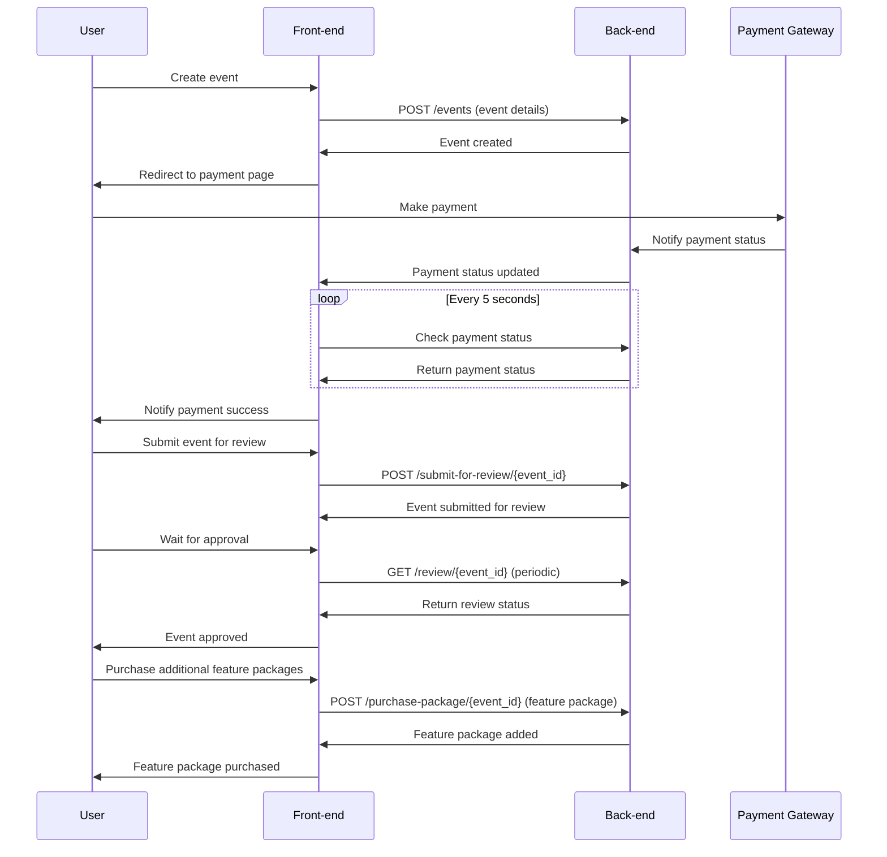

To incorporate the requested changes into your event management flow, including the sequence of creating an event, paying for it, submitting it for review, and purchasing additional feature packages after acceptance, I will outline the sequence diagram and modify your API to include these functionalities.

### Updated API Endpoints

1. **Add endpoint to submit an event for review after payment.**
2. **Add endpoint to purchase additional feature packages.**

Here is the updated section of your `event_router.py` that includes the new functionalities:

```python
@event_router.post("/submit-for-review/{event_id}", response_model=dict, tags=["event"])
async def submit_event_for_review(event_id: str):
    event = events_db.get(event_id)
    if not event:
        raise HTTPException(status_code=404, detail="Event not found")
    if event['status'] != 'paid':  # Assuming status is updated to 'paid' once payment is confirmed
        raise HTTPException(status_code=400, detail="Payment not confirmed for event")
    event['status'] = 'under review'
    return {"message": "Event submitted for review"}

@event_router.post("/purchase-package/{event_id}", response_model=dict, tags=["event"])
async def purchase_feature_package(event_id: str, package: str):
    event = events_db.get(event_id)
    if not event:
        raise HTTPException(status_code=404, detail="Event not found")
    if event['status'] != 'approved':
        raise HTTPException(status_code=400, detail="Event not approved for additional features")
    event['package'].append(package)
    return {"message": "Feature package added"}
```

### Sequence Diagram for the Event Management Process

Below is the Mermaid sequence diagram describing the process from creating an event to purchasing feature packages after approval:



### Usage of the Diagram

1. **Copy and Paste**: You can copy and paste the above Mermaid code into any Markdown editor or tool that supports Mermaid diagrams, such as GitHub, GitLab, or Markdown applications like Typora.
2. **Rendering the Diagram**: Once pasted, the Mermaid code will render a sequence diagram that visually represents the interaction between the user, the frontend, the backend, and the payment gateway during the event management process.

This sequence diagram and the updated API ensure that the flow of creating an event, handling payments, submitting for review, and purchasing additional packages after acceptance is clear and structured. It facilitates a smooth user experience by outlining the necessary steps and backend interactions required for a successful event lifecycle management.